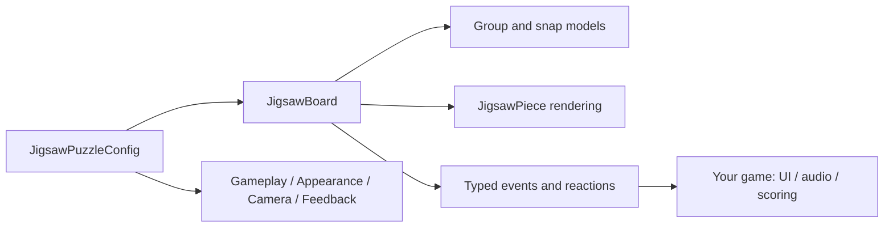

<div align="center">


# JigsawG

**Build expressive 2D jigsaw puzzles in Godot.**

One scene node · reusable Resources · procedural interlocking pieces · no addon dependencies

[](https://godotengine.org/)
[](https://docs.godotengine.org/en/stable/tutorials/scripting/gdscript/)
[](LICENSE)
[](docs/TESTING.md)

**[Quick start](#quick-start)** · **[Features](#features)** · **[Controls](#controls)** · **[Documentation](#documentation)**

</div>

---

> **Preview release.** The public Resource and event APIs are designed for integration, but large-puzzle performance, input methods and release checks must be validated in your target Godot environment. See the [release checklist](docs/TESTING.md).

## What is JigsawG?

A resource-driven **2D puzzle runtime** for [Godot 4.7](https://godotengine.org/). Drop a `JigsawBoard` into your scene, give it an image and a `JigsawPuzzleConfig`, and let the plugin generate pieces, manage connected groups and handle navigation. **Your game owns the HUD, progression, audio and save-slot UI.**

## Features

| | Capability | Details |
| :---: | --- | --- |
| 🧩 | **Six connector families** | Classic, Rounded, Angular, Compact, Mixed and asymmetric **Organic**; complementary Bézier edges |
| 🖱️ | **Intuitive grouping** | Single-piece drag, Ctrl-highlighted multi-selection, compact group arrangement and exact snapping |
| 🧮 | **Choose difficulty by count** | Manual rows × columns, or an **Auto** grid near a requested 4–4000 pieces |
| 🧭 | **Large-puzzle navigation** | Smooth zoom, panning, edge-scroll, spatial picking, **Home** for the board, **End** for overview, **F** for selection |
| 🪄 | **Customizable presentation** | Selection outlines, colored piece contours, style presets, materials and interchangeable motion adapters |
| 💾 | **Resumable state** | Save/restore positions, rotations, groups and Mosaic locks in Godot Resources |
| 🔊 | **Event-driven integration** | Typed events, audio, VFX, `AnimationPlayer` and method-call reactions |
| ⚙️ | **Scalable generation options** | Seeded layouts, spatial-hash Chaotic shuffle and optional cancellable frame batches |

Two play styles are included: **Free** (assemble independent connected groups anywhere) and **Mosaic** (place pieces at their original positions).

## Quick start

1. Copy **`addons/jigsawg/`** into your project at `res://addons/jigsawg/`.
2. Enable **JigsawG** in **Project → Project Settings → Plugins**.
3. Add a `JigsawBoard` to a 2D scene. Add an active `Camera2D` if you want built-in navigation.
4. In the Board Inspector, assign **Puzzle Config → New JigsawPuzzleConfig** and save it as a `.tres`.
5. Select a **Puzzle Texture**, configure the grid and press **Run**.

```text
PuzzleScreen (Node2D)
├── Camera2D                 # optional; enabled/current
└── JigsawBoard              # puzzle_config = forest.tres
```

Prefer to configure it from code?

```gdscript
@onready var board = $JigsawBoard

func start_puzzle(image: Texture2D) -> void:
    var config := JigsawPuzzleConfig.new()
    config.puzzle_texture = image
    config.grid_mode = JigsawPuzzleConfig.GridMode.AUTO
    config.target_piece_count = 500
    config.appearance.connector_family = JigsawAppearanceSettings.ConnectorFamily.ORGANIC
    config.gameplay.generation_batch_size = 96
    board.configure(config)
```

**Note:** Auto selects a visually balanced grid, so the actual piece count can differ slightly. For a precise count, use Manual rows/columns. With no image, a diagnostic checkerboard is used (not suitable for large puzzles).

**Try the demo:** open this repository as a Godot project and run [`examples/puzzle_lab.tscn`](examples/puzzle_lab.tscn). The included preset is a development example; you can adjust its connector family, grid and artwork in the Inspector.

## Make it yours

The Board exposes **one Inspector entry:** `puzzle_config`. Its sections separate durable gameplay rules from presentation:

| Resource | Controls |
| --- | --- |
| `JigsawGameplaySettings` | Free/Mosaic, rotation, snapping, multi-selection, shuffle, ghost/preview, generation batches |
| `JigsawAppearanceSettings` | Connector family/depth, Bézier detail, artwork filtering, **piece edge color**, material and highlights |
| `JigsawCameraSettings` | Board/overview framing, zoom, pan, smoothing, bounds and keyboard shortcuts |
| `JigsawFeedbackSettings` | Pickup/snap tints, feedback timing and optional `JigsawMotionAdapter` |

A few recipes:

- **For natural pieces:** choose **Organic**, raise `connector_variation` and use a balanced Auto grid.
- **For dark images:** use a lighter **Piece Edge Color**, plus a moderate **Piece Edge Opacity** and width. These change rendering only, never the snap geometry.
- **For large puzzles:** use high-resolution *original* artwork, set **Generation Batch Size** to 64–128 and keep **Camera → Initial Focus** on Auto. When batching is enabled, JigsawG first fits and displays the **whole mosaic/assembly guide** for one frame, before spawning the first piece batch; it then applies the final camera framing after scattering.
- **For custom animations:** assign a `JigsawMotionAdapter` under Feedback; its subclasses can animate rotation and multi-group arrangement without changing logical transforms.

### Source image quality matters

2000 pieces cut a photograph into ~2000 tiny source regions. Increasing Bézier detail only smooths contours—it **cannot restore missing image pixels**. The Board can warn when pieces fall below a configurable 96 native pixels per side:

```gdscript
var detail := $JigsawBoard.get_artwork_detail_info()
print(detail.get("native_pixels_per_piece", Vector2.ZERO))
print(detail.get("recommended_source_size", Vector2i.ZERO))
```

Be mindful of VRAM and maximum texture sizes when choosing ultra-high-resolution photographs.

## Controls

| Input | Action |
| --- | --- |
| **Drag** a piece | Move it or its already-connected group |
| **Ctrl + click** | Add/remove a group from the highlighted multi-selection |
| **Drag** a selected group | Move all selected groups; distant groups arrange compactly |
| **Right-click** | Rotate by 90° when enabled |
| **Mouse wheel** | Zoom at cursor |
| **Empty-space drag / middle drag** | Pan the camera |
| **Home / End** | Focus assembly board / show all scattered pieces |
| **F** | Return to the last clicked piece or frame all Ctrl-selected groups |
| **P** | Toggle the full-image reference preview |

All relevant controls are configurable through the Gameplay and Camera Resources. A normal single click leaves no persistent highlight; Ctrl selections stay visibly outlined.

## Integrate without rewriting the puzzle

Use public Board signals for HUDs and built-in `JigsawReaction` Resources for sounds, particle scenes or host animations:

```gdscript
@onready var board = $JigsawBoard

func _ready() -> void:
    board.progress_changed.connect(_update_progress)
    board.puzzle_finished.connect(_on_puzzle_finished)

func _update_progress(progress: float) -> void:
    $HUD/ProgressBar.value = progress * 100.0

func _on_puzzle_finished(_event: JigsawPuzzleEvent) -> void:
    $Results.show()
```

**For saving:** call `capture_state()` / `restore_state()` or `capture_resume_config()`. **For no-code feedback:** add a `JigsawAudioReaction`, `JigsawSpawnSceneReaction`, `JigsawPlayAnimationReaction` or `JigsawCallMethodReaction` to your config's **Reactions** array.

## Development checks

Use the pinned Godot 4.7.2 regression runner (import + every fast `tests/test_*.gd` script):

```bash
python3 scripts/ci/run_tests.py --godot /path/to/godot
python3 scripts/ci/run_tests.py --godot /path/to/godot --test test_camera_selection_focus
```

It rejects script/parser errors, non-zero exit codes and missing test success markers. The heavy 200/500/2000-piece benchmark is separate. The presence of a CI workflow does **not** mean these tests have already passed on a particular Godot installation.

## Architecture



The addon is self-contained inside `addons/jigsawg/`. `examples/`, `tests/` and `docs/` belong to this **development repository**, not the distributable runtime. No host code needs to access the Board's internal group dictionaries or modify piece transforms.

## Documentation

| Guide | When you need it |
| --- | --- |
| **[Resource API](docs/RESOURCE_API.md)** | Every setting, Board methods, scene integration, state and lifecycle |
| **[Events & reactions](docs/EVENTS_AND_REACTIONS.md)** | Inspector audio/VFX recipes, animation adapters and custom event hooks |
| **[Testing & release checklist](docs/TESTING.md)** | Regression scripts, large-puzzle benchmarks and packaging checks |
| **[Development roadmap](docs/ROADMAP.md)** | Prioritized work on scale, accessibility, organization and release readiness |
| **[AI agent instructions](AGENTS.md)** | Architecture invariants, working process and test matrix for coding agents |
| **[Changelog](CHANGELOG.md)** | Version history and preview limitations |
| **[Contributing](CONTRIBUTING.md)** · **[Security](SECURITY.md)** | Development workflow and responsible disclosure |

### Validation and limitations

- Mouse and keyboard are the primary supported input path; touch/controllers are not yet certified.
- Puzzles of 200, 500 and 2000 pieces have dedicated benchmark scripts under `tests/`; actual performance is device-dependent.
- Host code owns save slots, campaigns, achievements and multiplayer input routing.
- **Example image redistribution rights have not been independently verified.** Use properly licensed artwork in published projects. See [example artwork notes](examples/images/README.md).

[Report a problem](https://github.com/sempitern0/JigsawG/issues) with your Godot version, platform, reproduction steps, puzzle Resource and relevant engine logs.

---

<div align="center">

**Made for Godot · Built with GDScript · Licensed under [MIT](LICENSE)**

</div>
